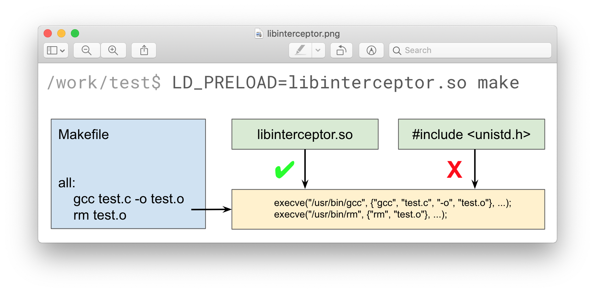
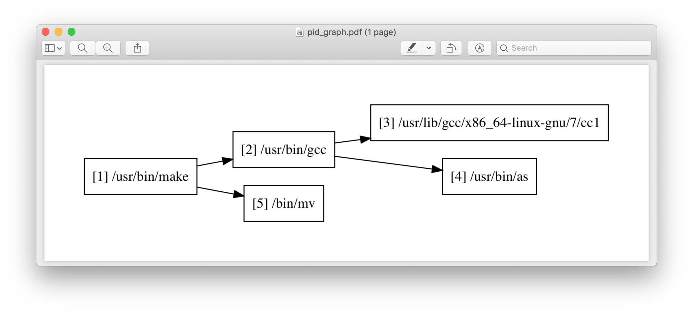
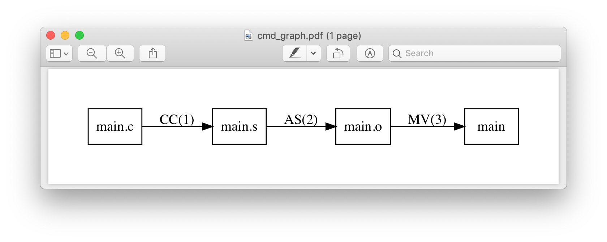

# How to use Clade

The simplest way to start using Clade is to run the following command:

``` shell
$ clade make
```

where *make* should be replaced by your project build command. Clade will
execuite build, intercept build commands, parse them and generate a lot of data
about build process and source files. The following sections explain formats
of the generated data, as well as some other things.

All functionality is available both as command-line scripts and
as Python modules that you can import and use, so the following
examples will include both use cases.

## Build command intercepting

Intercepting of build commands is quite easy: all you need is to
wrap your main build command like this:

``` shell
$ clade -i make
```

where *make* should be replaced by your project build command.
The output file called *cmds.txt* will be stored in the directory named *clade*
and will contain all intercepted commands, one per line.

Note that *clade -i* only intercepts build commands and does not process
them in any way.

You can change the path to to the file where intercepted commands will be
saved using --cmds option:

``` shell
$ clade -i --cmds /work/cmds.txt make
```

In case the build process of your project consists of several independent
steps, you can still create one single *cmds.txt* file using
-a (--append) option:

``` shell
$ clade -i make step_one
$ clade -i -a make step_two
```

As a result, build commands of the second make command will be appended
to the *cmds.txt* file created previously.

You can intercept build commands from a python script as well:

``` python
from clade import Clade
c = Clade(cmds_file="cmds.txt")
c.intercept(command=["make"], append=False)
```

Clade implements several different methods of build commands intercepting.


### Library injection

Clade can intercept the *exec* calls issued by the build tool for each build
command.
To do this we have developed a shared library (called *libinterceptor*)
that redefine such exec functions: before creating a new process our
exec functions store the information about the command into a separate file.
The library is than injected into the build process using
*LD_PRELOAD* (Linux) and *DYLD_INSERT_LIBRARIES* (macOS) mechanisms provided by
the dynamic linker.



Library injection is used by default.

### Wrappers

There is an alternative intercepting method that is based on
*wrappers*. It can be used when LD_PRELOAD is unavailable:

``` shell
$ clade -i -wr make
```

Clade scans `PATH` environment variable to detect available
executable files.
Then it creates a temporary directory and creates
wrappers for all this executables.
Each wrapper simply logs arguments with which it was called and
then executes original executable.
To ensure that wrapper will be called instead of the original command
Clade adds this temporary directory to the `PATH`.

This method can't intercept commands that are executed
bypassing the PATH environment variable: for example, `gcc` command can be
intercepted, but directl call of `/usr/bin/gcc` cannot be.
If you need to intercept such commands you may use `Wrapper.wrap_list`
configuration option (read about configuration in the
[configuration](configuration.md) section).
Files specified in `Wrapper.wrap_list` will be temporarily replaced
by wrappers (in some cases it may require administrative privileges).
It is possible to specify directories in `Wrapper.wrap_list`:
in that case all executable files in them will be replaced by wrappers.

You can intercept build commands with wrappers from a python script:

``` python
from clade import Clade

conf = {"Wrapper.wrap_list": ["/usr/bin/gcc", "~/.local/bin"]}
c = Clade(cmds_file="cmds.txt")
c.intercept(command=["make"], use_wrappers=True, conf=conf)
```

### Windows debugging API

Wrappers and library injection works only on Linux and macOS.
To intercept build commands on Windows we have implemented another approach
that is based on the Windows debugging API.
The API provides the mechanism for the debugger to be notified of debug events
from the process being debugged and to pause the target process until the
event has been processed.

We have developed a simple debugger that can be used to debug the build
process.
It waits for the process start events, which corresponds to the execution of the build
command, pauses the build process and reads memory of the newly created process
to find and log its command line arguments, and then resumes the build process.

It can be used like this:

``` shell
$ clade -i msbuild MyProject.sln
```

You can intercept build commands on Windows from a python script:

``` python
from clade import Clade

c = Clade(cmds_file="cmds.txt")
c.intercept(command=["msbuild", "MyProject.sln])
```

## Content of cmds.txt file

Let's look at the simple makefile:

``` makefile
all:
    gcc main.c -o main
    rm main
```

If we try to intercept `make all` command,
the following `clade/cmds.txt` file will be produced (on macOS):

```
/work/simple_make||0||/usr/bin/make||make||all
/work/simple_make||1||/Library/Developer/CommandLineTools/usr/bin/make||/Library/Developer/CommandLineTools/usr/bin/make||all
/work/simple_make||2||/usr/bin/gcc||gcc||main.c||-o||main||-O3
/work/simple_make||3||/Library/Developer/CommandLineTools/usr/bin/gcc||/Library/Developer/CommandLineTools/usr/bin/gcc||main.c||-o||main||-O3
/work/simple_make||4||/usr/bin/xcrun||/usr/bin/xcrun||clang||main.c||-o||main||-O3
/work/simple_make||5||/Library/Developer/CommandLineTools/usr/bin/clang||/Library/Developer/CommandLineTools/usr/bin/clang||main.c||-o||main||-O3
/work/simple_make||6||/Library/Developer/CommandLineTools/usr/bin/clang||/Library/Developer/CommandLineTools/usr/bin/clang||-cc1||-triple||x86_64-apple-macosx10.14.0||-Wdeprecated-objc-isa-usage||-Werror=deprecated-objc-isa-usage||-emit-obj||-disable-free||-disable-llvm-verifier||-discard-value-names||-main-file-name||main.c||-mrelocation-model||pic||-pic-level||2||-mthread-model||posix||-mdisable-fp-elim||-fno-strict-return||-masm-verbose||-munwind-tables||-target-cpu||penryn||-dwarf-column-info||-debugger-tuning=lldb||-target-linker-version||409.12||-resource-dir||/Library/Developer/CommandLineTools/usr/lib/clang/10.0.0||-O3||-fdebug-compilation-dir||/work/simple_make||-ferror-limit||19||-fmessage-length||150||-stack-protector||1||-fblocks||-fencode-extended-block-signature||-fobjc-runtime=macosx-10.14.0||-fmax-type-align=16||-fdiagnostics-show-option||-fcolor-diagnostics||-vectorize-loops||-vectorize-slp||-o||/var/folders/w7/d45mjl5d79v0hl9gqzzfkdgh0000gn/T/main-de88a6.o||-x||c||main.c
/work/simple_make||7||/Library/Developer/CommandLineTools/usr/bin/ld||/Library/Developer/CommandLineTools/usr/bin/ld||-demangle||-lto_library||/Library/Developer/CommandLineTools/usr/lib/libLTO.dylib||-dynamic||-arch||x86_64||-macosx_version_min||10.14.0||-o||main||/var/folders/w7/d45mjl5d79v0hl9gqzzfkdgh0000gn/T/main-de88a6.o||-lSystem||/Library/Developer/CommandLineTools/usr/lib/clang/10.0.0/lib/darwin/libclang_rt.osx.a
/work/simple_make||2||/bin/rm||rm||main
```

You can try to use `cmds.txt` file directly, but its format is not quite
user-friendly and is subject to change.
It is a good idea not to rely on the format of `cmds.txt` file
and use the interface module instead:

``` python
from clade.cmds import get_all_cmds
cmds = get_all_cmds("cmds.txt")
```

where `cmds` is a list of dictionaries representing each intercepted command.
For example, dictionary that represents `gcc` command from the above makefile
looks like this:

``` json
{
    "command": [
        "gcc",
        "main.c",
        "-o",
        "main",
        "-O3"
    ],
    "cwd": "/work/simple_make",
    "id": "3",
    "pid": "2",
    "which": "/usr/bin/gcc"
}
```

where:

* *command* - is intercepted command itself;
* *cwd* - is a path to the directory where the command was executed;
* *id* - is a unique identifier assigned to the command;
* *pid* - is an identifier of the parent command
  (command that executed the current one - in our example
  it is an identifier of the make command);
* *which* - path to an executable file that was executed
  as a result of this command.

It should be noted that all other functionality available in Clade use
`cmds.txt` file as an input.
Due to this you do not need to rebuild your project every time you want
to use it - you can just use previously generated `cmds.txt` file.

## Parsing of intercepted commands

Build command intercepting is performed internally by the `clade` command, so
in most cases you do not need to think about it.
Once build commands are intercepted they can be parsed to search for input
and output files, and options. Currently there are *extensions* in Clade
for parsing following commands:

* C compilation commands (cc, gcc, clang, various cross compilers);
* C++ compilation commands;
* Microsoft CL compilation commands;
* linker commands (ld, ld.lld, link);
* assembler commands (as);
* archive commands (ar);
* move commands (mv, cmd.exe -c);
* object copy commands (objcopy);

These extensions can be executed from command line through `clade -e EXTENSION_NAME`,
where EXTENSION_NAME can be CC, CXX, LD, AS, AR, MV, Objcopy, CL, or Link, like this:

``` shell
$ clade -e CC make
```

As a result, a working directory named `clade` will be created:

```
clade/
├── cmds.txt
├── clade.log
├── conf.json
├── meta.json
├── CC/
│   ├── cmds.json
│   ├── bad_ids.txt
│   ├── cmds/
│   ├── deps/
│   ├── opts/
│   └── raw/
├── PidGraph/
├── Storage/
└── ...
```

Top-level directories are in turn working directories of corresponding
extensions that were executed inside `clade` command.
`CC` extension is the one we wanted to execute, but there are also
other extensions - `PidGraph` and `Storage` - that were executed implicitly
by `CC` because it depends on the results of their work.
Let's skip them for now.

Inside `CC` directory there is a bunch of other directories and `cmds.json`
file with parsed compilation commands.
Again, it is a list of dictionaries representing each parsed command.
Let's look at the parsed command from the above example:

``` json
{
    "cwd":"/work/simple_make",
    "id":"3",
    "in":[
        "/work/simple_make/main.c"
    ],
    "out":[
        "/work/simple_make/main"
    ]
}
```

Its structure is quite simple: there is a list of input files,
a list of output files, unique identifier of the command, and
the directory where the command was executed.

Using the identifier of the command it is possible to get some additional information,
like its options.
Options of all parsed commands are located in the separated json files
inside `opts` folder.
Options of the command with `id="3"` are located in the `opts/3.json` file
and look like this:

``` json
[
    "-O3"
]
```

Raw unparsed commands are located in the `raw` folder.
Its structure resembles the structure of the `opts` folder, so the
raw command of the command with `id="3"` is located in the `raw/3.json` file
and looks like this:

``` json
[
    "gcc",
    "main.c",
    "-o",
    "main",
    "-O3"
],
```

`CC` extension also identify *dependencies* of the main source file
for each compilation command.
Dependencies are the names of all included header files,
even ones included indirectly.
Clade stores them inside `deps` subfolder.
For example, dependencies of the parsed command with `id="3"` can be found
in `deps/3.json*` file:

``` json
[
    "/usr/include/secure/_common.h",
    "/usr/include/sys/_types/_u_int32_t.h",
    "/usr/include/machine/_types.h",
    "/usr/include/sys/_types/_u_int16_t.h",
    "/usr/include/_stdio.h",
    "/usr/include/sys/cdefs.h",
    "/usr/include/secure/_stdio.h",
    "/usr/include/sys/_types/_size_t.h",
    "/usr/include/sys/_types/_u_int8_t.h",
    "/usr/include/stdio.h",
    "/usr/include/sys/_types/_ssize_t.h",
    "/usr/include/sys/_symbol_aliasing.h",
    "/usr/include/sys/_types/_int32_t.h",
    "/usr/include/sys/_pthread/_pthread_types.h",
    "/usr/include/sys/_types/_int8_t.h",
    "/work/simple_make/main.c",
    "/usr/include/sys/_types/_int16_t.h",
    "/usr/include/sys/_types/_uintptr_t.h",
    "/usr/include/sys/_types/_null.h",
    "/usr/include/sys/_types/_off_t.h",
    "/usr/include/sys/stdio.h",
    "/usr/include/_types.h",
    "/usr/include/AvailabilityInternal.h",
    "/usr/include/sys/_types/_va_list.h",
    "/usr/include/Availability.h",
    "/usr/include/sys/_posix_availability.h",
    "/usr/include/sys/_types/_u_int64_t.h",
    "/usr/include/sys/_types/_intptr_t.h",
    "/usr/include/sys/_types.h",
    "/usr/include/sys/_types/_int64_t.h",
    "/usr/include/i386/_types.h",
    "/usr/include/i386/types.h",
    "/usr/include/machine/types.h"
]
```

Besides dependencies, all other parsed commands (ld, mv, and so on)
will also look this way: as a list of dictionaries representing each
parsed command, with `"id"`, `"in"`, `"out"` and `"cwd"` fields.

All data generated by `CC` extension (and by all other extensions, of course)
can also be used through Python interface:

``` python
from clade import Clade

# Initialize interface class with a path to the working directory
# and a path to the file with intercepted commands
c = Clade(work_dir="clade", cmds_file="cmds.txt")

# Get a list of all parsed commands
for cmd in c.get_all_cmds_by_type("CC"):
    # Get a list of dependencies
    deps = c.get_cmd_deps(cmd["id"])
    # Get options
    opts = c.get_cmd_opts(cmd["id])
    # Get raw unparsed command
    raw = c.get_cmd_raw(cmd["id])
    ...
```

## Pid graph

Each intercepted command, except for the first one, is executed by another,
parent command. For example, `gcc` internally executes
`cc1` and `as` commands, so `gcc` is their parent.
Clade knows about this connection and tracks it by assigning to each intercepted
command two attributes: a unique identifier (`id`) and identifier of its parent
(`pid`).
This information is stored in the *pid graph* and can be obtained using
`PidGraph` extension:

``` shell
$ clade -e PidGraph make
$ tree clade -L 2

clade
├── cmds.txt
└── PidGraph
       ├── pid_by_id.json
       └── pid_graph.json
```

Two files will be generated. First one - `pid_by_id.json` - is a simple
mapping from ids to their pids and looks like this:

``` json
{
    "1": "0",
    "2": "1",
    "3": "2",
    "4": "2",
    "5": "1"
}
```

Another one - `pid_graph.json` - stores information about all parent commands
for a given id:

``` json
{
    "1": ["0"],
    "2": ["1", "0"],
    "3": ["2", "1", "0"],
    "4": ["2", "1", "0"],
    "5": ["1", "0"]
}
```

*Pid graph* can be used through Python interface:

``` python
from clade import Clade

# Initialize interface class with a path to the working directory
# and a path to the file with intercepted commands
c = Clade(work_dir="clade", cmds_file="cmds.txt")
c.parse("PidGraph)

# Get all information
pid_graph = c.pid_graph
pid_by_id = c.pid_by_id
```

Other extensions use *pid graph* to filter *duplicate* commands.
For example, on macOS executing `gcc main.c` command leads to the
chain of execution of the following commands:

* /usr/bin/gcc main.c
* /Library/Developer/CommandLineTools/usr/bin/gcc main.c
* /usr/bin/xcrun clang main.c
* /Library/Developer/CommandLineTools/usr/bin/clang main.c
* /Library/Developer/CommandLineTools/usr/bin/clang -cc1 ...

So, for a single compilation command, several commands will be actually
intercepted. You probably need only one of them (the very first one),
so Clade filter all *duplicate* ones using *pid graph*: Clade simply
do not parse all child commands of already parsed command.
This behavior is of course configurable and can be disabled.

*Pid graph* can be visualized with Graphviz using one of
the [configuration](configuration.md) options:



Note: *pid graph* can be used with any project
(not only with ones written in C).

## Command graph

Clade can connect commands by their input and output files.
This information is stored in the *command graph* and can be obtained using
`CmdGraph` extension.

To appear in the *command graph*, an intercepted command needs to be parsed
to search for input and output files.
By default all commands that Clade knows about are parsed and appeared
in the *command graph*.
This behavior can be changed via [configuration](configuration.md).

Let's consider the following makefile:

``` makefile
all:
    gcc -S main.c -o main.s  # id = 1
    as main.s -o main.o      # id = 2
    mv main.o main           # id = 3
```

Using `CmdGraph` these commands can be connected:

``` shell
$ clade -e CmdGraph make

clade/
├── cmds.txt
├── CmdGraph/
│   ├── cmd_graph.json
│   └── cmd_type.json
├── CC/
├── LD/
├── MV/
├── PidGraph/
└── Storage/
```

where `cmd_graph.json` looks like this (commands are represented by their
identifiers and the type of extensions that parsed it):

``` json
{
    "1":{
        "used_by": ["2", "3"],
        "using": []
    },
    "2":{
        "used_by": ["3"],
        "using": ["1"]
    },
    "3":{
        "used_by": [],
        "using": ["1", "2"]
    }
}
```

and `cmd_type.json` looks like this:

``` json
{
    "1": "CC",
    "2": "AS",
    "3": "MV"
}
```

*Command graph* can be used through Python interface:

``` python
from clade import Clade

# Initialize interface class with a path to the working directory
# and a path to the file with intercepted commands
c = Clade(work_dir="clade", cmds_file="cmds.txt")

# Get the command graph
cmd_graph = c.cmd_graph
cmd_type = c.cmd_type
```

*Command graph* can be visualized with Graphviz using one of
the configuration options:



## Source graph

For a given source file Clade can show in which commands this file
is compiled, and in which commands it is indirectly used.
This information is called *source graph* and can be generated
using `SrcGraph` extension:

``` shell
$ clade -e SrcGraph make

clade/
├── cmds.txt
├── SrcGraph/
│   ├── src_graph
│   └── src_info.json
├── CmdGraph/
├── CC/
├── LD/
├── MV/
├── PidGraph/
└── Storage/
```

*Source graph* for the Makefile presented in the *command graph* section above
will be located in the `src_graph` folder and contain multiple files that,
when combined, looks like this:

``` json
{
    "/usr/include/stdio.h": {
        "compiled_in": ["1"],
        "loc": 414,
        "used_by": ["2", "3"]
    },
    "main.c":{
        "compiled_in": ["1"],
        "loc": 5,
        "used_by": ["2", "3"],
    },
    "main.s":{
        "compiled_in": ["2"],
        "loc": 20,
        "used_by": ["3"],
    }
}
```

For simplicity information about other files has been removed from
the presented *source graph*.
As always, commands are represented through their unique identifiers.

`src_info.json` contains information about the size of the source file
in lines of code.

*Source graph* can be used through Python interface:

``` python
from clade import Clade

# Initialize interface class with a path to the working directory
# and a path to the file with intercepted commands
c = Clade(work_dir="clade", cmds_file="cmds.txt")

# Get the source graph
src_graph = c.src_graph
src_info = c.src_info
```

## Call graph

Clade can generate function *call graph* for a given project written in `C`.
This requires `CIF` installed on your computer, and path to its bin directory
added to the `PATH` environment variable.

*Call graph* can be generated using `Callgraph` extension:

``` shell
$ clade -e Callgraph cmds.txt
```

*Call graph* itself is stored inside `Callgraph/callgraph` folder and can be
rather large. Let's look at a small part of the call graph generated for
the Linux kernel:

``` json
{
    "drivers/net/usb/asix_common.c": {
        "asix_get_phy_addr": {
            "called_in": {
                "drivers/net/usb/asix_devices.c": {
                    "ax88172_bind": {
                        "242": {"match_type" : 1}
                    },
                    "ax88178_bind": {
                        "809": {"match_type" : 1}
                    }
                }
            },
            "calls": {
                "drivers/net/usb/asix_common.c": {
                    "asix_read_phy_addr": {
                        "235": {"match_type" : 5}
                    }
                }
            },
            "type": "extern"
        }
    }
}
```

There is `drivers/net/usb/asix_common.c` file with definition of the
`asix_get_phy_addr` function. This function is called in the
`drivers/net/usb/asix_devices.c` file by `ax88172_bind` function on line
`242` and by `ax88178_bind` function on line `809`. `match_type` is an internal
information needed for debug purposes. Also, this function calls `asix_read_phy_addr`
file from the `drivers/net/usb/asix_common.c` file on the line `235`.

All functions that call `asix_get_phy_addr` function or are called by it are
also present in the *call graph*, but were excluded from the above example.

`Callgraph` extension uses `Function` extension to get information about
function definitions and declarations.
They are stored in the *Functions/functions* folder:

``` json
{
    "asix_get_phy_addr": {
        "drivers/net/usb/asix_common.c": {
            "declarations": {
                "drivers/net/usb/asix.h": {
                    "line": "204",
                    "signature": "int asix_get_phy_addr(struct usbnet *);",
                    "type": "extern"
                }
            },
            "line": "232",
            "signature": "int asix_get_phy_addr(struct usbnet *dev);",
            "type": "extern"
        }
}
```

For each function definition there is information about corresponding
declaration, line numbers in which the definition and declaration are located,
function signature and type (global or static).

`Callgraph` and `Functions` can be used through Python interface:

``` python
from clade import Clade
from clade.types.nested_dict import traverse

# Initialize interface class with a path to the working directory
# and a path to the file with intercepted commands
c = Clade(work_dir="clade", cmds_file="cmds.txt")

# Get the call graph
callgraph = c.callgraph


for file, func in traverse(callgraph, 2):
    for caller_file, caller_func, call_line in traverse(callgraph[file][func]["called_in"], 3):
        ...

    for called_file, called_func, call_line in traverse(callgraph[file][func]["calls"], 3):
        ...

functions = c.functions
# The usage is quite similar, so it is omitted
```

## Compilation database

Command line tool for generating compilation database has a different
interface, compared to most other command line tools available in Clade.
Compilation database can be generated using `clade-cdb` command:

``` shell
$ clade-cdb make
```

where `make` should be replaced by your project build command.
As a result your project will be build and the `compile_commands.json`
file will be created in the current directory.

If you have `cmds.txt` file you can skip the build process and get
`compile_comands.json` much faster:

``` shell
$ clade-cdb --cmds cmds.txt
```

Other options are available through `--help` option.

*Compilation database* can be used through Python interface:

``` python
from clade import Clade

# Initialize interface class with a path to the working directory
# and a path to the file with intercepted commands
c = Clade(work_dir="clade", cmds_file="cmds.txt")

# Intercept build commands
# This step can be skipped if build commands are already intercepted
c.intercept(command=["make"], append=False, use_wrappers=False)

# Parse intercepted commands and generate compilation database
c.parse("CDB")

# Get compilation database
compilation_database = c.compilation_database
```
